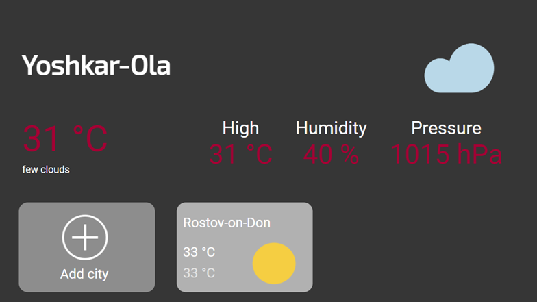

# Weather app for SMART TV

## Description
The project was created as part of an education practice at LG Electronics, Inc. The goal is to create a web application with a weather forecast for Smart TV.

**The project is available at the link**: https://khairullinamm.github.io/weather-app-smartTV/#ru

## Technology stack
1. FlexBox
2. Fetch API
3. Web OS
4. LocalStorage
5. JSON 

## Features
1.  Getting list of cities from dadata.ru
2.  Getting weather information from openweathermap.org
3.  Custom select by using jQuery
4.  Saving data to localStorage
5.  Two languages

## Project status
_Project is: in progress_

### TODO:
1. Change class names according to BEM methodology.
2. Finish the presence of two languages in the application; at the moment, the display is incorrect.
3. Finish the functionality for navigation with a television remote control.
4. Make code refactoring.
5. Try to make select without jQuery.
6. Fix problems with saved data in localStorage.
7. Write commands for build and setup app at WebOS
8. Improve design

## Contacts 
[@milanahmm](https://t.me/milanahmm) - contact me!

